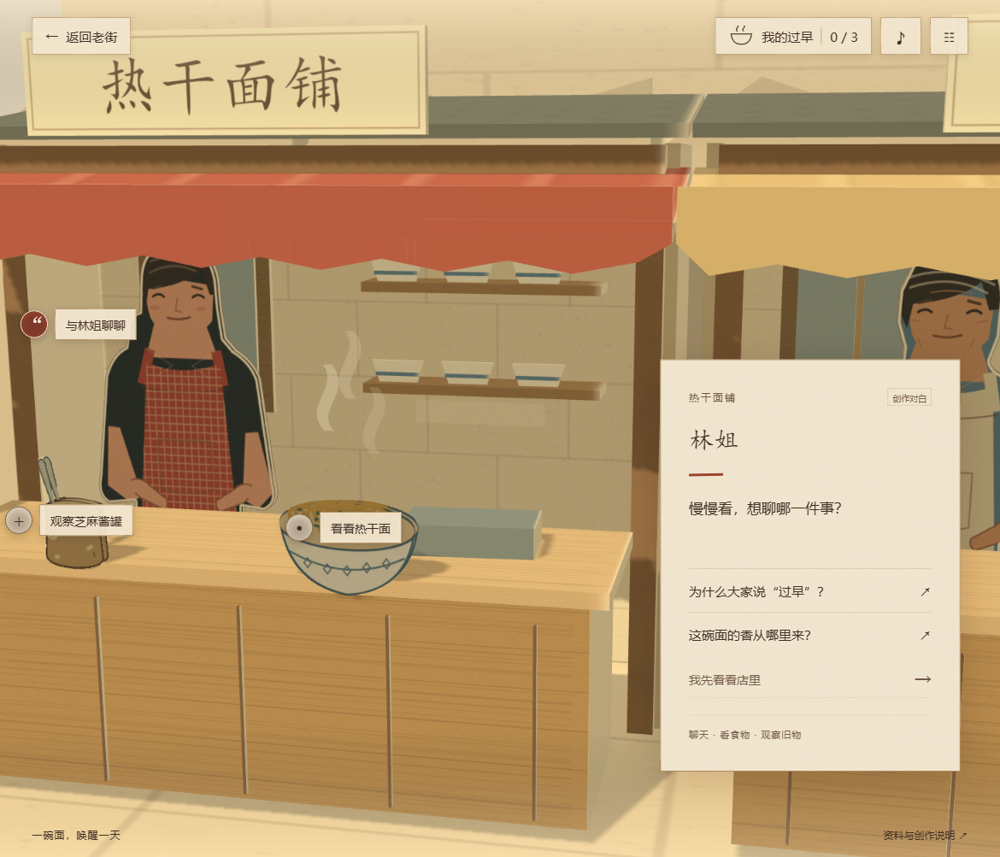

# 过早旧影 · 三维纸景版 v1.1

走进一张照片，听见武汉的清晨。React、TypeScript、Three.js、GSAP 与 Vite 实现的本地交互叙事，已按 2026-09-30 的纸景方向接入三家早餐铺。



公开源码：[GEMING-eng/wuhan-breakfast-paper-stage](https://github.com/GEMING-eng/wuhan-breakfast-paper-stage)。无需登录即可查看与下载。

## 立即预览

下载 [v1.1 完整实施包](https://github.com/GEMING-eng/wuhan-breakfast-paper-stage/releases/tag/v1.1.0)，解压后目录中已提供 `dist/` 构建。Windows 双击 `Start-Preview.cmd`，打开终端显示的 `http://127.0.0.1:4173/`。需要 Node.js 22.18 或以上版本；这台开发机器使用 Node 24.19。预览不需要安装 npm 依赖，也不需要联网。

从 GitHub 的 Code 按钮下载或克隆的是源码，需要按下一节安装依赖、构建后再预览。`dist` 与 `node_modules` 不进入源码提交。仓库与发布包公开可访问；网站目前通过本地服务运行。

**不要直接双击 dist/index.html**：ES 模块与资源须通过本地 HTTP 服务读取。退出终端或 Ctrl+C 可停止服务。

## 继续开发

```powershell
npm.cmd ci
npm.cmd run dev
npm.cmd test
npm.cmd run build
npm.cmd run preview
```

开发入口通常是 `http://127.0.0.1:5173/`。构建使用相对 base path，可放在静态服务的子目录。没有后端、账号、在线 AI 对话、支付或远程美术依赖。

## 体验与实现

- 新体验：相册对白 → 拿起照片 → 展开纸层并推进镜头 → 任意顺序进入三家店。
- 每家店有两条基础话题、一件可观察旧物和观察后解锁的追问。读完追问末句才生成记忆；看过物件不会误算完成。
- 允许提前回到今天，再继续探索；三条记忆齐备后可以回望照片并进入完整结尾。
- 进度只写入本项目键 `wuhan-breakfast-story.save.v1`。刷新恢复稳定对白节点；重新开始需确认，保留声音与阅读设置。
- 每间店用真实几何搭建：纸板地面、后墙、带门洞的框架、折面雨棚、盒状柜台、分层货架、轮廓纸偶、纸片食物与器物。小凳由座面、四条腿和横撑组成。灯光产生空间投影，场景不是一张整图。
- 一套 WebGL renderer，桌面、手机横屏与竖屏使用不同相机预设。旧物观察靠近同一模型，热点由世界坐标投影并做遮挡检查。
- 照片来自同一历史纸景的固定镜头渲染。入口同步 HTML 相纸边框、真实纸层展开和相机推进；支持跳过与简化动效。
- 提供静音、音量、简化动效、直接显示对白和低性能模式。低性能模式保留几何纸层，降低像素比并关闭阴影、蒸汽。上下文丢失有提示、恢复和重试入口。

## 目录

| 位置 | 内容 |
|---|---|
| `src/content/` | 完整对白、店铺与事实来源数据、现行素材清单 |
| `src/app/` | 状态机、持久化、页面与覆盖层 |
| `src/scene3d/` | 几何、材质、相机、投影与命中、渲染生命周期 |
| `public/assets/` | 12 件原创 SVG 图案、同景照片、原创合成 WAV |
| `tools/` | 美术/音频生成程序、静态预览、开发验收导出 |
| `docs/verification/` | 页面和纸景截图及实际视口、相机、状态记录 |
| `docs/legacy-art/` | 保留的旧整图方案与原平面渲染组件，仅作参考 |
| `tests/` | 内容与状态机、存档、三维命中和相机验证 |

开发时访问 `?review=1` 可使用本地验收面板，导出截图、模拟 WebGL 丢失与存储失败。它不进入正式构建；验收导出服务只由 Vite 的本地开发服务提供。

## 验证与边界

实际页面已完成三店观察、追问、三条记忆、照片回望与完整结尾；也验证了部分结尾、刷新继续、长菜单、Esc 关闭、低性能和真实 WebGL 上下文恢复。具体证据与未覆盖范围见 [验收记录](docs/verification/README.md)。

手机验证为浏览器模拟尺寸，**未做真实手机测试**；不承诺所有设备满帧。声音是合成环境与选择声，没有真人配音。纸偶造型是本版原创矢量美术，后续可以在同一几何轮廓与尺寸规范内继续精修。

本作依据武汉饮食文化资料进行艺术化演绎，街段与人物为虚构，不是某一历史地点的精确复原。资料页区分资料、创作对白与主题归纳；未复制馆藏照片或网络摄影。参见 [素材与交接说明](docs/交接说明.md) 和 `src/content/sources.ts`。
